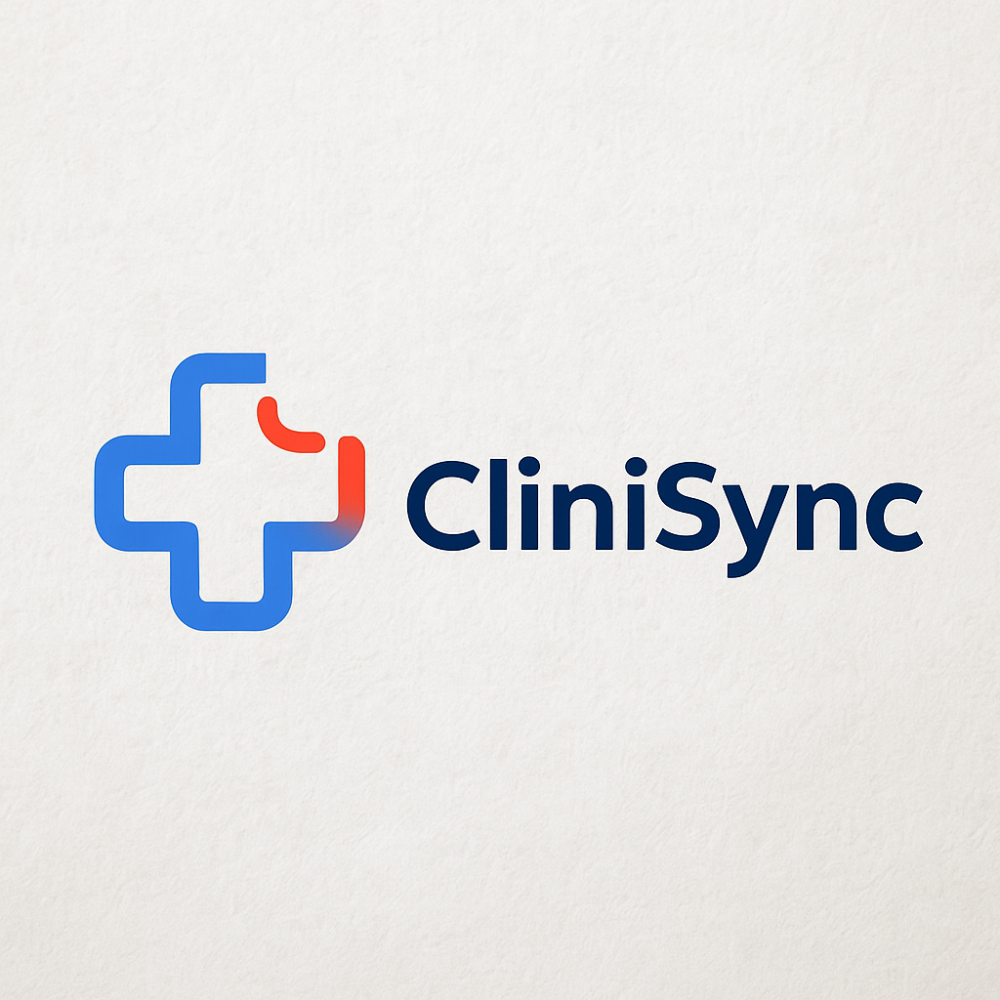
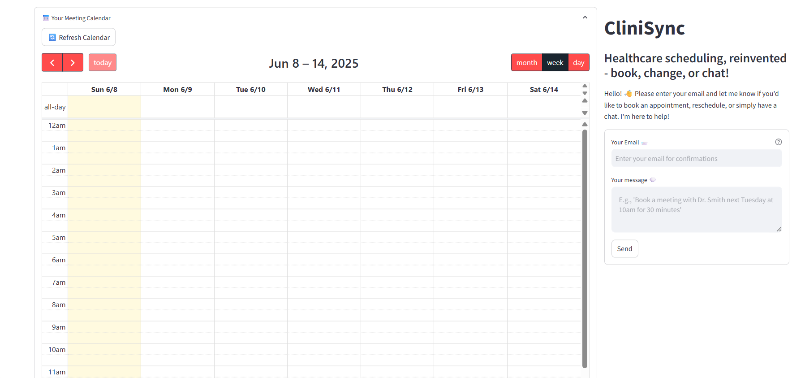

# 🗓️ CliniSync: AI Meeting Scheduler

**CliniSync** is an AI-powered chatbot that intelligently schedules, reschedules, and manages meetings via natural conversation. Designed to streamline workflows across domains like healthcare, enterprise support, and internal operations, CliniSync automates tedious calendar tasks, boosts productivity, and delivers a seamless scheduling experience.

---


## 📽️ Demo

🎥 [Click to watch the demo video](demo/clinisync_demo.mp4)

<p align="center">
  <a href="demo/clinisync_demo.mp4">
    
  </a>
</p>

---

## 🧠 What It Does

- ✅ Understands natural language queries (e.g., “Schedule a meeting with Dr. Mehta at 4 PM tomorrow for followup medical visit”)
- ✅ Extracts and validates intent and time-slot availability
- ✅ Suggests alternate slots if a conflict exists
- ✅ Schedules/reschedules meetings and saves them in a local calendar (SQLite)
- ✅ Conversational interface that mimics a real assistant experience

---

## 🚀 Business Problem

Scheduling meetings in large organizations often results in:

- Repetitive manual effort
- Calendar conflicts and errors
- Delayed responses and productivity loss

---

## ✅ Solution Highlights

- 🎯 Eliminates scheduling friction and manual coordination  
- 📆 Avoids double-booking with intelligent conflict resolution  
- 🤖 Works as a plug-in assistant or part of enterprise tech support bots  
- 🧩 Can be integrated with internal CRMs or helpdesk systems  
- 🔁 Supports real-time meeting modifications with full context retention  

---

## 💡 Business Impact

By automating appointment workflows, CliniSync:

- 🔄 Increases meeting adherence
- 👥 Frees up administrative staff for high-value work
- 📈 Enhances collaboration by ensuring smooth calendar operations

When integrated with enterprise virtual assistants or tech support bots, it:

- ✔️ Speeds up support call scheduling and resolution
- ✔️ Facilitates real-time cross-team collaboration
- ✔️ Reduces manual overhead on scheduling teams

---

## 🧰 Tech Stack

| Component       | Description                                      |
|----------------|--------------------------------------------------|
| **LLM Backend** | Gemma 3B model via Ollama (local LLM runner)     |
| **LangChain**   | For prompt chaining, chat flow, and parsing      |
| **Streamlit**   | Interactive chat UI                              |
| **SQLite**      | Lightweight persistent event storage             |
| **Python**      | Core implementation and orchestration            |
| **FastAPI**     | Backend RestAPI Framework                        |

---

## 🗂️ Folder Structure

```bash
CliniSync/
├── app.py                 
├── config.py
├── requirements.txt
├── README.md
├── .gitignore
│
│
├── demo/
│   ├── clinisync_logo.png
│   ├── concept_map.png
│   ├── clinisync.mp4
│   ├── Demo1.mp4
│   ├── Demo2.mp4
│   └── screen.png
│
├── models/
│   ├── chat.py
│   ├── chitchat.py
│   ├── email_send.py
│   ├── event.py
│   ├── event_display.py
│   ├── meet_schedule.py
│   ├── meet_reschedule.py
│   ├── user_chat.py
│   └── user_intent.py
│
├── prompts/
│   ├── chitchat_prompt.py
│   ├── schedule_prompt.py
│   └── reschedule_prompt.py
│
├── routes/
│   └── chat_routes.py
│
├── schemas/
│   └── chat_schemas.py
│
├── test_notebooks/
│   ├── test.ipynb
│   └── test_calendar.py
│
└── structure.txt

